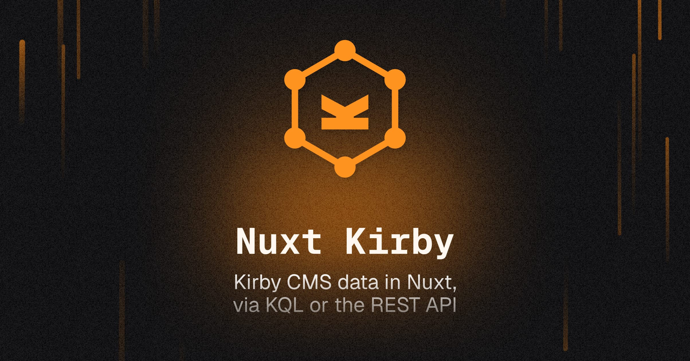

[](https://nuxt-kirby.byjohann.dev)

# Nuxt Kirby

[Kirby CMS](https://getkirby.com) data in [Nuxt](https://nuxt.com), via [KQL](https://github.com/getkirby/kql) or the REST API.

- [✨ &nbsp;Release Notes](https://github.com/johannschopplich/nuxt-kirby/releases)
- [📖 &nbsp;Read the documentation](https://nuxt-kirby.byjohann.dev)

## Features

- 🔒 Protected Kirby credentials on every request
- 🪢 Supports token-based authentication with the [Kirby Headless plugin](https://kirby.tools/docs/headless/getting-started/) (recommended)
- 🍱 Handle requests just like with the [`useFetch`](https://nuxt.com/docs/api/composables/use-fetch) composable
- 🦦 [Multiple starter kits](https://nuxt-kirby.byjohann.dev/essentials/starter-kits) available
- 🗃 Cached query responses
- 🤹 No CORS issues
- 🦾 Strongly typed

## Setup

```bash
npx nuxt module add kirby
```

## Basic Usage

Add Nuxt Kirby to your Nuxt configuration:

```ts
// `nuxt.config.ts`
export default defineNuxtConfig({
  modules: ['nuxt-kirby']
})
```

And send queries in your template:

```vue
<script setup lang="ts">
const { data, error, status } = await useKql({
  query: 'site'
})
</script>

<template>
  <div>
    <h1>{{ data?.result?.title }}</h1>
    <pre>{{ JSON.stringify(data?.result, undefined, 2) }}</pre>
  </div>
</template>
```

The [documentation](https://nuxt-kirby.byjohann.dev) covers authentication, multi-language sites and every module option.

## 💻 Development

1. Clone this repository
2. Enable [Corepack](https://github.com/nodejs/corepack) using `corepack enable`
3. Install dependencies using `pnpm install`
4. Run `pnpm run dev:prepare`
5. Start development server using `pnpm run dev`

## License

[MIT](./LICENSE) License © 2022-PRESENT [Johann Schopplich](https://github.com/johannschopplich)
